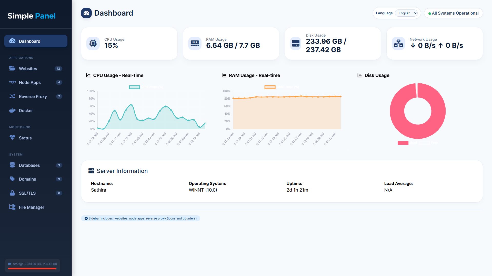

<div align="center">


**Fast. Simple. Powerful Hosting Control.**

</div>

---

> [!WARNING]
> This Project is still under development. You can also contribute to this project.




## 🚀 How to Use

### 1. **Start a PHP Server**

Run the following command in the frontend directory:

```bash
php -S localhost:8000
```

Then open your browser and navigate to:
```
http://localhost:8000
```

### 2. **Navigation**

The application uses URL parameters for navigation:

- `http://localhost:8000/` - Default page (Dashboard)
- `http://localhost:8000/?page=dashboard` - Dashboard (Server Monitoring)
- `http://localhost:8000/?page=websites` - Websites
- `http://localhost:8000/?page=nodeapps` - Node Apps
- `http://localhost:8000/?page=revproxy` - Reverse Proxy
- `http://localhost:8000/?page=databases` - Databases
- `http://localhost:8000/?page=domains` - Domains
- `http://localhost:8000/?page=ssl` - SSL/TLS
- `http://localhost:8000/?page=filemanager` - File Manager

## ✨ Features

### 📊 Real-time Dashboard
- **CPU Usage Monitoring** - Live CPU utilization with color-coded progress bars and real-time graph
- **RAM Usage** - Memory consumption tracking with used/total display and historical graph
- **Disk Usage** - Storage usage monitoring with doughnut chart visualization
- **Network Stats** - Network traffic monitoring (received/sent)
- **Server Information** - Hostname, OS, uptime, and load average
- **Auto-refresh** - Dashboard updates automatically every 3 seconds
- **Interactive Charts** - Real-time line graphs using Chart.js showing last 20 data points
- **Visual Progress Bars** - Color-coded indicators (green/orange/red based on usage)

### 🌐 Multi-language Support
- **English (default)** - Primary language for the interface
- **Sinhala (සිංහල)** - Automatic translation using Google Translate API
- **Dynamic Translation** - All text is automatically translated in real-time
- **Easy Language Switching** - Toggle between languages via the language selector
- **Translation Caching** - Reduces API calls by caching translated text

To switch languages, use the language dropdown in the top bar or add `?lang=si` to the URL.

### 📁 Complete File Manager
- **File Browsing** - Navigate through directories with breadcrumb navigation
- **Upload Files** - Drag & drop or click to upload multiple files at once
- **Download Files** - Download any file with a single click
- **Create Folders** - Create new directories anywhere in the file system
- **Delete Files/Folders** - Remove single or multiple items (with confirmation)
- **Rename** - Rename files and directories
- **File Information** - View detailed file info including size, type, modified date, and permissions
- **Search** - Real-time search filter for quick file finding
- **Multiple Views** - Switch between grid and list view modes
- **Bulk Selection** - Select multiple files for batch operations
- **Real-time Progress** - Visual upload progress indicator
- **Responsive Design** - Works seamlessly on all screen sizes

### 🗄️ Database Management with phpMyAdmin
- **Professional Database Admin** - Industry-standard phpMyAdmin interface integrated into the panel
- **Full Database Control** - Create, modify, drop databases with intuitive interface
- **Table Management** - Manage database tables with SQL operations
- **Query Builder** - Execute SQL queries with visual query editor
- **User Management** - Manage database users and privileges
- **Data Import/Export** - Import and export data in multiple formats (SQL, CSV, JSON, XML)
- **Server Monitoring** - Monitor database server status and performance
- **Backup & Recovery** - Easy database backup and restore functionality
- **Theme Integration** - Fully styled with panel color scheme for seamless integration
- **Multi-Server Support** - Configure and manage multiple database connections

#### Setup phpMyAdmin

phpMyAdmin 5.2.1 is included and pre-installed in the `vendor/phpmyadmin/` directory.

**1. Configure Database Connection:**

Edit the phpMyAdmin configuration file:
```
vendor/phpmyadmin/config.inc.php
```

Update the server settings:
```php
$cfg['Servers'][1]['host'] = 'localhost';        // Database server address
$cfg['Servers'][1]['port'] = 3306;               // Database port (3306 for MySQL)
$cfg['Servers'][1]['username'] = 'root';         // Database username
$cfg['Servers'][1]['password'] = 'password';     // Database password (if needed)
$cfg['Servers'][1]['auth_type'] = 'cookie';      // Authentication type
```

**2. Change Blowfish Secret (Security):**

Generate a new random 32-character string and update:
```php
$cfg['blowfish_secret'] = 'your-random-32-char-string-here';
```

**3. Access phpMyAdmin:**

Navigate to the Databases page in your panel:
```
http://localhost:8000/?page=databases
```

Or access directly:
```
http://localhost:8000/vendor/phpmyadmin/index.php
```

**4. Configure Additional Database Servers (Optional):**

To manage multiple database servers, add more configurations:
```php
// PostgreSQL Server
$cfg['Servers'][2]['host'] = 'postgres.example.com';
$cfg['Servers'][2]['port'] = 5432;
$cfg['Servers'][2]['extension'] = 'pgsql';
$cfg['Servers'][2]['auth_type'] = 'cookie';
$cfg['Servers'][2]['verbose'] = 'PostgreSQL Server';

// MySQL Remote Server
$cfg['Servers'][3]['host'] = 'mysql.example.com';
$cfg['Servers'][3]['port'] = 3306;
$cfg['Servers'][3]['auth_type'] = 'cookie';
$cfg['Servers'][3]['verbose'] = 'Remote MySQL';
```

**5. Security Recommendations:**

- ⚠️ Always use HTTPS in production environments
- 🔐 Use strong database passwords
- 👥 Avoid using root accounts for regular operations
- 📋 Restrict IP access to phpMyAdmin using `.htaccess` or firewall rules
- 🔄 Regularly backup your databases
- 🛡️ Keep phpMyAdmin updated to the latest version

**6. Complete Documentation:**

For detailed configuration options and advanced features, refer to:
- `PHPMYADMIN_SETUP.md` - Complete setup and configuration guide
- `PHPMYADMIN_QUICKSTART.md` - Quick reference for common tasks
- Official phpMyAdmin Docs: https://docs.phpmyadmin.net/


